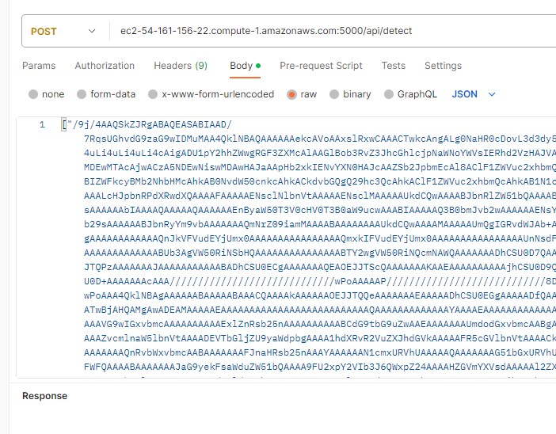

### How to run: 
- run **docker_build.sh** script
- run **docker_run.sh** script
- run **python3 request.py** to execute a request to the api which sends two selected images from the folder **object-detection-SMALL_2_files**
  - This will send a request to the API service that is deployed locally
  
### How to make a call to the API deployed on AWS:
As it stands, the endpoint can be found at [http://ec2-54-161-156-22.compute-1.amazonaws.com:5000/api/detect]().
The request should look like in the image below:
